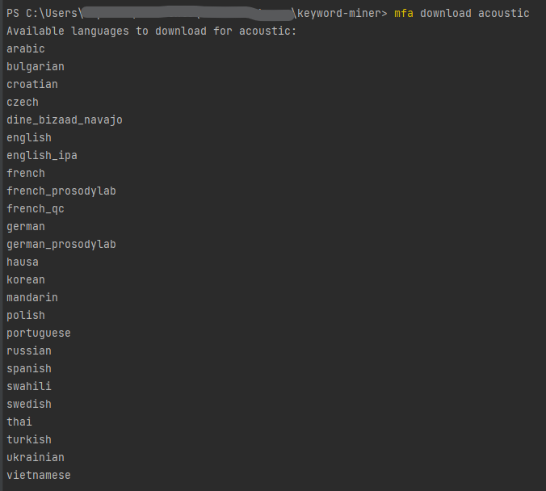

# Welcome to Keyword Miner!

This repository contains ***an alternative and independent implementation*** of the framework **Keyword Miner**, originally discussed in the paper [SiDi KWS: A Large-Scale Multilingual Dataset for Keyword Spotting](https://www.isca-speech.org/archive/interspeech_2022/meneses22_interspeech.html). The goal of this repository is to allow the keyword-spotting community to export large sets of single-spoken keyword audio files based on the forced alignment of transcribed input speech recordings, as described in that paper.

# Overview

Given a speech audio file and its transcript, KeywordMiner runs [MFA](https://github.com/MontrealCorpusTools/Montreal-Forced-Aligner) to force-align that transcript text to the recorded speech, which outputs the start and end times of each spoken word. Based on that information, KeywordMiner segments each keyword as an individual labeled audio file. The following sessions presented more details about this implementation of KeywordMiner.

## Specifications

-  **Datasets**: The audio files to be segmented must accompany an associated text file with the transcript of the speech recording.

-  **Supported languages**: Any of the same languages supported by the MFA models, as prompted on [this list](#language-id).

-  **Audio file format**: Any (audio) format is supported since the files will be converted to .wav format.

>  **Note**: The input datasets must be compatible with one of the structure formats featured by the implemented TranscribedDataset interface (*i.e.* LibriSpeech or Mozilla Common Voice).

## How to use

- [optional] Create a virtual environment using some tool of your choice (*e.g.*, **conda** or **pip-env**)

- [optional] Activate the previous virtual environment

- Install the requirements: `pip install -r requirements.txt --upgrade`

- Install pretrained acoustic models as [specified by MFA](https://montreal-forced-aligner.readthedocs.io/en/latest/pretrained_models.html#pretrained-models): `mfa download acoustic <language_id>`

- [optional] Validate alignment setup: `mfa validate <corpus_directory> <dictionary_path> <[optional_acoustic_model_path]>`

- Run the main script: `python main.py`

The validation step aims to help the developer determine the success of the installation, but it is not a required part of the setup process.

### Language ID
If no language ID is passed as an argument, a list of available IDs will be prompted, as shown in the screenshot below:



When installing a pre-trained model, one of the IDs must be provided according to the intended language or preferred alternative model to be used.

*i.e.*, for a model trained in English, one could use: `mfa download acoustic english`

## System design
### Folders
This project's folders are structured as follows:

```
root/
└── datasets/
└── inputs/
├── configs/
└── lexicons/
└── source/
```

Those folders have the following properties:
-  **datasets/**: holds the implementation responsible for matching the transcript files to match the structure required by the aligner.

-  **inputs/configs/**: stores the configuration files with the arguments used by this project.

-  **inputs/lexicons/**: contains the pronunciation dictionaries for each language.

-  **source/**: holds this project's main source code.

>  **Note:** This project also creates a local directory named ***outputs***, which is listed in file ***.gitignore***. That directory's subfolders hold the outputs of this project (*e.g.*, segmented audio files).

### Entities
Currently, this project considers three main entities: TranscribedDataset, Aligner, Segmenter. All of them are shortly described below:

-  **TranscribedDataset**: Represents an interface for the different formats compatible with each dataset (LibriSpeech, Mozilla Common Voice).
-  **Aligner**: Points the timestamp of single words in the recordings according to its transcripts.
-  **Segmenter**: Uses the alignment to segment the recordings into keywords.

# License and Credits

This repository is available under the MIT license. In case you publish any research based on results obtained with this repository, please consider citing the authors of the original paper:

```
@inproceedings{meneses22_interspeech,
    author={Michel Cardoso Meneses and Rafael Bérgamo Holanda and Luis Vasconcelos Peres and Gabriela Dantas Rocha},
    title={{SiDi KWS: A Large-Scale Multilingual Dataset for Keyword Spotting}},
    year=2022,
    booktitle={Proc. Interspeech 2022},
    pages={4616--4620},
    doi={10.21437/Interspeech.2022-394}    
}
```

# Support

If you have any questions about this project, please open an issue ticket on this repository or contact me via e-mail: michel.conrado.meneses@gmail.com